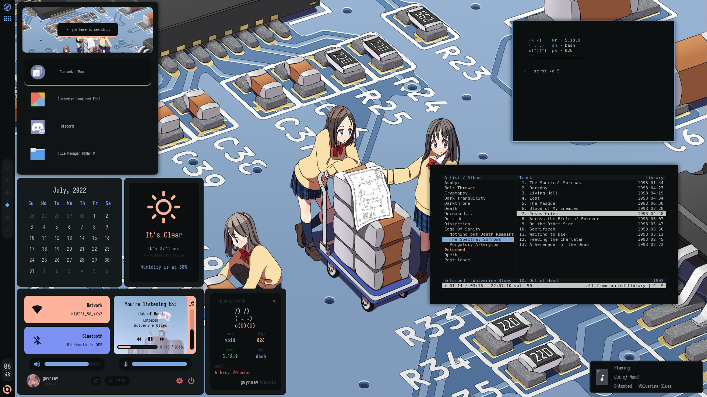

# Welcome to my newbish dotfiles!

First of all, this rice uses [Kizu's](https://github.com/janleigh/dotfiles) colorscheme, and some other stuff of theirs as well. So please do show them some love.

This is my first time uploading my dotfiles to GitHub, and I haven't even been using Linux and ricing for that long, so please be patient and don't hesitate to point out anything that could be improved about the manner in which I present them here.



The dashboard is the combination of a series of windows which can be closed independently: the main System Panel, the Fetch, Calendar and Weather, and a simple powermenu.

# Dependencies/Requirements

- [**BSPWM**](https://github.com/baskerville/bspwm) for the Window Manager and [**SXHKD**](https://github.com/baskerville/sxhkd) for Keybindings.
- [**EWW**](https://github.com/elkowar/eww) for the Bar and other Widgets.
  - The music player uses **playerctl** to interact with music playback.
  - The eww_fullscreen_fix.sh script requires **xdo** in order to work.
- [**hsetroot**](https://github.com/himdel/hsetroot) for the Wallpaper.
- Either [**Kitty**](https://github.com/kovidgoyal/kitty) or [**Alacritty**](https://github.com/alacritty/alacritty) for the Terminal Emulator, both have config files in this repo (defaults use Kitty). You may also choose to use your own. 
- By default the shell is **bash**. However, I did my best to keep all the scripts in this rice POSIX compliant and the only file that uses bash in specific is my bashrc file, which you can easily replace for your own shell's equivalent. Yes, all the scripts have been extensively tested with shells other than bash.
- This said, the Shell Prompt is [**Starship**](https://github.com/starship/starship). Yet again, since most people use either bash or zsh, you either want this or you don't.
- [**Dunst**](https://github.com/dunst-project/dunst) is used for Notifications.
- [**Rofi**](https://github.com/davatorium/rofi) is used for Application Search.
- [**Picom**](https://github.com/yshui/picom) is used for the compositor, although a lot of people like using forks of this.
- The fonts are [**Sarasa Mono CL**](https://github.com/be5invis/Sarasa-Gothic) for Main Font, [**SFMono**](https://github.com/NishantGadihoke/SFMonoFont) for Terminal Font, and [**JetBrainsMono Nerd Font**](https://github.com/tomwei7/JetBrainsMono-Nerd-Front) for the Nerd Font, plus it's used a bit for text too.
- The Icon Theme is [Zafiro Icons](https://github.com/zayronxio/Zafiro-icons).


# Installation
### Bulk
Most packages mentioned above are rather common so they should be available for your distro's repos. I'll be using the 2 distros I have experience with as examples. You may also, optionally, replace Kitty for Alacritty. 

For **Arch Linux**, run:
```
# pacman -S bspwm sxhkd hsetroot kitty starship dunst rofi picom playerctl xdo
```
For **Void Linux**, run:
```
# xbps-install -S bspwm sxhkd hsetroot kitty starship dunst rofi picom playerctl xdo
```

### EWW
**EWW** in specific is complicated or not, depending on the distro. If you are on **Arch**, you can just get it off the **AUR**, by using a manager like yay:
```
$ yay -s eww
```
If you're on **Void Linux**, you can use the [**void-packages**](https://github.com/void-linux/void-packages) package for **EWW**. For this, follow the guide to install xbps-src in that repo linked just before this, and run:
```
$ cd /path/to/void-packages
$ ./xbps-src pkg eww
# xbps-install --repository hostdir/binpkgs eww
```
If you're on a different distro, I haven't really used any other than this two in my short time using Linux, so I'm sorry but I can't help. Do check the [install guide for EWW](https://elkowar.github.io/eww/).

### Fonts
This also depends on the distro.

**Arch Linux** has all 3 fonts in the **AUR**. So you can just do:
```
$ yay -S ttf-sarasa-ui-sc otf-sfmono-patched  nerd-fonts-jetbrains-mono
```
**Void Linux** only has Sarasa Mono CL in their repos and void-packages.
```
# xbps-install -S font-sarasa-gothic
```
You can install the rest of the fonts by copying their files into /usr/share/fonts/ or ~/.local/share/fonts (if it exists), and then run:
```
$ fc-cache -f
```
It may happen that your font names don't match the ones used in these dots, in which case, run:
```
$ fc-list | grep -i "YOURFONTNAME"
```
Find what the font is actually called, and change it in the config files. All the widgets used in EWW use the fonts defined at the beginning of the eww.scss file, so you just need to change those for that. Rofi has the font name inside config.rasi, and the terminals do so in their corresponding configuration files.

### Icons
Copy the Zafiro-icons directory to ~/.local/share/icons
```
$ git clone https://github.com/zayronxio/Zafiro-icons.git
$ cp -r Zafiro-icons ~/.local/share/icons/
```

### Configuration files
Now that you have all your dependencies in check, you can just copy the files in this repo to their corresponding spots.
```
The following command requires git. It can be installed through your package manager.
$ git clone https://github.com/Gwynsav/messydots.git
$ cd ~/messydots
$ cp -r config/* ~/.config/
$ cp -r local/bin/* ~/.local/bin/
$ cp bashrc ~/.bashrc && cp xinitrc ~/.xinitrc && cp Xresources ~/.Xresources
```
If you get an error saying "no such file or directory" from any of these commands, just create the corresponding directory.

# Thank you for your attention
And especially thank you for RTFM!

This rice was made possible by [Kizu's](https://github.com/janleigh/dotfiles) and [Rxyhn's](https://github.com/rxyhn/bspdots) dots, both of which I used for reference when I didn't know how to do something, and that was very often.
